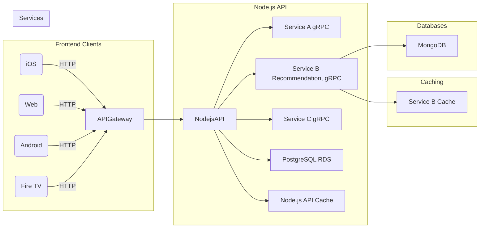

# Netflux

## Diagram

```mermaid
graph LR
  subgraph Frontend Clients
    A(iOS) -->|HTTP| APIGateway
    B(Web) -->|HTTP| APIGateway
    C(Android) -->|HTTP| APIGateway
    D(Fire TV) -->|HTTP| APIGateway
  end

  APIGateway --> NodejsAPI

  subgraph Node.js API
    NodejsAPI --> ServiceA
    NodejsAPI --> ServiceB
    NodejsAPI --> ServiceC
    NodejsAPI --> PostgreSQL
    NodejsAPI --> NodejsCache
  end

  subgraph Services
    ServiceA[Service A gRPC]
    ServiceB[Service B Recommendation, gRPC]
    ServiceC[Service C gRPC]
  end

  ServiceB --> MongoDB
  ServiceB --> ServiceBCache

  subgraph Caching
    NodejsCache[Node.js API Cache]
    ServiceBCache[Service B Cache]
  end

  subgraph Databases
    PostgreSQL[PostgreSQL RDS]
    MongoDB
  end


```